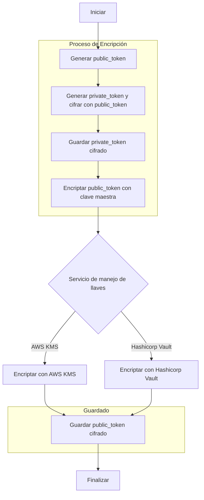

<a id="readme-top"></a>
<!-- TABLE OF CONTENTS -->
<details>
  <summary>Tabla de contenido</summary>
  <ol>
    <li>
      <a href="#sobre-el-proyecto">Sobre el proyecto</a>
      <ul>
        <li><a href="#tecnologías-utilizadas">Tecnologías utilizadas</a></li>
      </ul>
    </li>
    <li>
      <a href="#para-correr-el-programa">Para correr el programa</a>
      <ul>
        <li><a href="#prerequisitos">Prerequisitos</a></li>
        <li><a href="#instalación">Instalación</a></li>
      </ul>
    </li>
    <li><a href="#uso-del-programa">Uso del programa</a></li>
    <li><a href="#notas-sobre-el-codigo">Notas sobre el codigo</a></li>
    <li><a href="#recursos-de-referencia">Recursos de referencia</a></li>
  </ol>
</details>


<!-- ABOUT THE PROJECT -->
## Sobre el proyecto

Este proyecto demuestra la implementación de la tokenización de tarjetas, utilizando servicios de gestión de secretos como HashiCorp Vault y AWS Key Management Service (KMS). La tokenización es una técnica de seguridad que reemplaza datos sensibles con identificadores únicos que no tienen valor intrínseco ni pueden ser utilizados fuera de un contexto específico.

El objetivo principal de este demo es ilustrar cómo se pueden utilizar estas tecnologías avanzadas de cifrado y gestión de claves para mejorar la seguridad de la información sensible, y cómo podría realizarse un refactor del proyecto actual para almacenar tarjetas de manera segura utilizando Vault y KMS.
### Envelope Encryption
La tecnica de seguridad que el proyecto busca resaltar se llama **envelope encryption**. En esta técnica, una clave (datakey) se utiliza para cifrar los datos reales (en este caso los datos de una tarjeta bancaria), y luego esa clave de datos es cifrada con una clave maestra. 

En el modelo de datos de este proyecto cada tarjeta guarde un public_token y un private_token. El **public_token** sirve como datakey para el **private_token**. Lo que se necesita hacer es **ANTES** de guardar el valor del public_token, este se encripta utilizando otra llave maestra gestionada por un servicio de manejo de llaves. En el caso de este proyecto la **clave maestra** es gestionada por AWS KMS o Hashicorp Vault, dependiendo del servicio con el que se eliga correr el proyecto.

Para descirar los datos del private_token ahora sera necesario contar primero con el valor descifrado del public_token.




Para leer mas sobre "envelope encryption" puede ver los <a href="#recursos-de-referencia">recursos de referencia</a>.
<p align="right">(<a href="#readme-top">back to top</a>)</p>


### Tecnologías utilizadas

- **Java 22**
- **Spring Boot 3.3.0**
- <a href="https://aws.amazon.com/kms/">**AWS KMS**</a> 
- <a href="https://www.vaultproject.io/">**Hashicorp Vault**</a> 
- **AES**
- **Docker** 


<p align="right">(<a href="#readme-top">back to top</a>)</p>


<!-- GETTING STARTED -->
## Para correr el programa

Como se puede elegir 

### Prerequisitos
Para utilizar la app con el servicio de Hashicorp vault, solamente se necesita lo siguiente, en el archivo de docker se descarga la db y se configura el servicio de Vault.
- <a href="https://docs.docker.com/compose/install/">Docker Compose</a>
- <a href="https://openjdk.org/projects/jdk/22/">Java Developer Kit (JDK) 22</a>

Para utilizar el servicio con AWS KMS se necesitaran 2 cosas: 
1. Un token de AWS con acceso a KMS
2. Crear un CMK (Customer Master Key) desde la consola de AWS

Aquí hay un articulo donde demuestra como crear el CMK, tambien demuestra el uso de KMS desde la terminal: 
- <a href="https://enlear.academy/data-encryption-on-aws-part-02-ecb5b1e15451">Ejemplo de AWS KMS</a>

### Instalación

Para instalar el programa, siga los siguientes pasos:

1. Clone el repositorio
   ```sh
   git clone https://github.com/CancillerVEVO/aws-kms-demo.git
    ```
   
2. Cambie al directorio del proyecto
    ```sh
    cd aws-kms-demo
    ```
   
3. Construya el proyecto
    ```sh
    mvn clean install
    ```
4. Inicie el contenedor
    ```sh
    docker-compose up
    ```
   
5. Dentro del application.properties, cambie el valor de la variable **spring.profiles.active** a **vault** o **kms** para elegir el servicio de manejo de llaves que se desea utilizar.
    ```properties
    spring.profiles.active=vault
    ```
#### AWS KMS
Para utilizar el servicio de AWS KMS, se debe configurar el archivo application.properties con las siguientes variables:
```properties
# AWS
aws.region=region-de-tu-bucket
cmkKeyARN=el-arn-de-tu-cmk
```
#### Hashicorp Vault
Para utilizar el servicio de Vault no es necesario configurar nada, el servicio se configura automaticamente en el archivo de docker-compose.yml.
```properties
# Configuracion de acceso a Vault
# Estas variables se encuentran en el archivo docker-compose.yml
# En caso de instalar Vault localmente, se debe cambiar los valores por defecto
vault.uri=${VAULT_ADDR:http://127.0.0.1:8200}
vault.token=${VAULT_TOKEN:vault-root-password}
```

6. La base de datos se crea en el contenedor, para acceder a la base de datos se puede utilizar el siguiente comando:
    ```sh
    psql -h localhost -p 5433 -U postgres -d card-vault
    ```
   
Para acceder desde docker
```sh
docker exec -it postgres psql  -U postgres
```
La contraseña se encuentra dentro del docker-compose.yml
```yml
x-common-env: &cenv
  POSTGRES_PASSWORD: postgres-admin-password
  POSTGRES_USER: postgres
  POSTGRES_DB: card-vault
  VAULT_TOKEN: vault-root-password
  VAULT_ADDR: http://vault:8200
```


<p align="right">(<a href="#readme-top">back to top</a>)</p>


<!-- USAGE EXAMPLES -->
## Uso del programa
### Endpoints
#### POST Añadir tarjeta
http://localhost:8080/card

Estructura BODY
```json
{
    "cardNumber": "6969",
    "cardHolderName": "Emmanuel López Ojeda",
    "lastFourDigits": "1111",
    "cvv": "123",
    "expirationDate": "2027-01-01"
}
```
Ejemplo de uso
```sh
curl -X POST http://localhost:8080/card -H "Content-Type: application/json" -d '{
    "cardNumber": "6969",
    "cardHolderName": "Emmanuel López Ojeda",
    "lastFourDigits": "1111",
    "cvv": "123",
    "expirationDate": "2027-01-01"
}'
```

#### GET Obtener tarjeta

http://localhost:8080/card/{cardId}

Ejemplo de uso
```sh
curl -X GET http://localhost:8080/card/1
```


## Notas sobre el codigo
El proyecto tiene un paquete llamado adapters/keywrapper. Dentro se encuentra la clase de KMS y Vault para la encripción y desencripción de los datos. 
Ambos servicios implementan la interfaz KeyWrapperService, la cual tiene los métodos de encrypt y decrypt.
```java
public interface KeyWrapperService {
    public String encrypt(String plaintext);
    public String decrypt(String ciphertext);
}
```

**Si se quiere ver la implementacion** de estos servicios, entonces vea la carpeta services, dentro de com.stellatech.elopezo.kms
La clase CardService es donde se implementa la lógica de negocio para guardar y obtener las tarjetas. 

**GUARDAR TARJETA**
```java
  public CardEntity saveCard(Card card) throws Exception {

    String serializedCard = Utils.serializerCard(
            card.getCardNumber(),
            card.getExpirationDate(),
            card.getCvv()
    );

    String maskedCard = Utils.maskCard(card.getCardNumber());

    String publicToken = AESUtil.generateAESKey();
    SecretKey pulicTokenKey = AESUtil.decodeAESKey(publicToken);

    // Utilizar el public token para cifrar los datos de la tarjeta y crear el (privateToken)
    String privateToken = AESCryptoAdapter.encrypt(serializedCard, pulicTokenKey);

    // Utilizamos el servicio externo de KMS/Vault para cifrar el publicToken
    String encryptedPublicToken = keyWrapperService.encrypt(publicToken);

    CardEntity cardEntity = CardEntity.builder()
            .cardNumber(maskedCard)
            .cardHolderName(card.getCardHolderName())
            .expirationDate(card.getExpirationDate())
            .publicToken(encryptedPublicToken)
            .lastFourDigits(card.getCardNumber().substring(card.getCardNumber().length() - 4))
            .cvv("***")
            .build();

    CardEntity savedCard = cardRepository.save(cardEntity);

    CardVaultEntity cardVaultEntity = CardVaultEntity.builder()
            .privateToken(privateToken)
            .card(savedCard)
            .build();

    savedCard.setCardVault(cardVaultEntity);

    cardRepository.save(savedCard);

    return savedCard;
}
```

**OBTENER TARJETA**
```java
    public CardEntity getCard(Long id) throws Exception {

        CardEntity cardEntity = cardRepository.findById(id).orElseThrow(() -> new RuntimeException("Card not found"));


        // Utilizamos el servicio externo de KMS/Vault para descifrar el publicToken
        String publicToken = keyWrapperService.decrypt(cardEntity.getPublicToken());

        SecretKey pulicTokenKey = AESUtil.decodeAESKey(publicToken);

        // Utilizamos el publicToken para descifrar los datos de la tarjeta
        String serializedCard = AESCryptoAdapter.decrypt(cardEntity.getCardVault().getPrivateToken(), pulicTokenKey);

        log.info("Card decrypted: {}", serializedCard);

        return cardEntity;
    }
```


<p align="right">(<a href="#readme-top">back to top</a>)</p>


<!-- RECURSOS DE REFERENCIA -->
## Recursos de referencia

* [AWS KMS Envelope Encryption](https://medium.com/@dipandergoyal/aws-kms-envelop-encryption-explained-9db3bd56542b)
* [Sobre como utilizar Vault CLI](https://developer.hashicorp.com/vault/tutorials/getting-started)
* [Ejemplos de como utilizar SDK de AWS KMS](https://docs.aws.amazon.com/sdk-for-java/latest/developer-guide/java_kms_code_examples.html)
* [Sobre Spring Vault](https://docs.spring.io/spring-vault/reference/vault/vault.html)
* [Data Security: an Introduction to AWS KMS and HashiCorp Vault](https://blog.gitguardian.com/talking-about-data-security-an-introduction-to-aws-kms-and-hashicorp-vault/)
* [Want to Limit PCI DSS Scope? Use Tokenization](https://www.infosecinstitute.com/resources/management-compliance-auditing/want-limit-pci-dss-scope-use-tokenization/)
<p align="right">(<a href="#readme-top">back to top</a>)</p>


