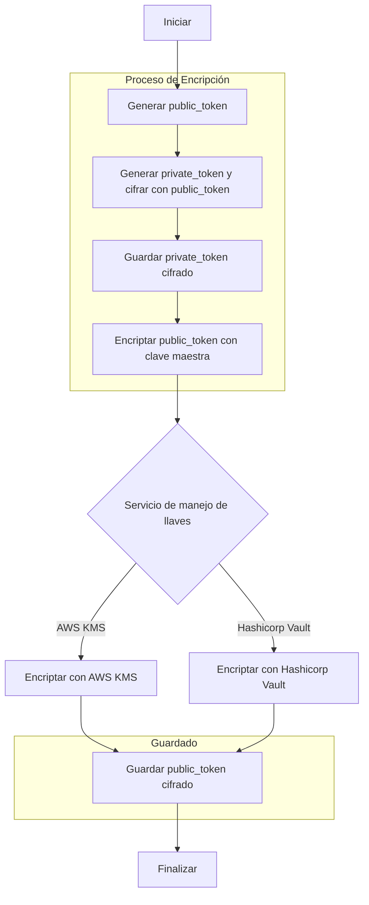

<a id="readme-top"></a>
<!-- TABLE OF CONTENTS -->
<details>
  <summary>Tabla de contenido</summary>
  <ol>
    <li>
      <a href="#sobre-el-proyecto">Sobre el proyecto</a>
      <ul>
        <li><a href="#tecnologías-utilizadas">Tecnologías utilizadas</a></li>
      </ul>
    </li>
    <li>
      <a href="#para-correr-el-programa">Para correr el programa</a>
      <ul>
        <li><a href="#prerequisitos">Prerequisitos</a></li>
        <li><a href="#instalación">Instalación</a></li>
      </ul>
    </li>
    <li><a href="#uso-del-programa">Uso del programa</a></li>
    <li><a href="#recursos-de-referencia">Recursos de referencia</a></li>
  </ol>
</details>


<!-- ABOUT THE PROJECT -->
## Sobre el proyecto

Este proyecto demuestra la implementación de la tokenización de tarjetas, utilizando servicios de gestión de secretos como HashiCorp Vault y AWS Key Management Service (KMS). La tokenización es una técnica de seguridad que reemplaza datos sensibles con identificadores únicos que no tienen valor intrínseco ni pueden ser utilizados fuera de un contexto específico.

El objetivo principal de este demo es ilustrar cómo se pueden utilizar estas tecnologías avanzadas de cifrado y gestión de claves para mejorar la seguridad de la información sensible, y cómo podría realizarse un refactor del proyecto actual para almacenar tarjetas de manera segura utilizando Vault y KMS.
### Envelope Encryption
La tecnica de seguridad que el proyecto busca resaltar se llama **envelope encryption**. En esta técnica, una clave (datakey) se utiliza para cifrar los datos reales (en este caso los datos de una tarjeta bancaria), y luego esa clave de datos es cifrada con una clave maestra. 

En el modelo de datos de este proyecto cada tarjeta guarde un public_token y un private_token. El **public_token** sirve como datakey para el **private_token**. Lo que se necesita hacer es **ANTES** de guardar el valor del public_token, este se encripta utilizando otra llave maestra gestionada por un servicio de manejo de llaves. En el caso de este proyecto la **clave maestra** es gestionada por AWS KMS o Hashicorp Vault, dependiendo del servicio con el que se eliga correr el proyecto.

Para descirar los datos del private_token ahora sera necesario contar primero con el valor descifrado del public_token.

<style>
    .mermaid {
        font-family: "Arial", sans-serif;
      width: 400px;
    }
</style>


Para leer mas sobre "envelope encryption" puede ver los <a href="#recursos-de-referencia">recursos de referencia</a>.
<p align="right">(<a href="#readme-top">back to top</a>)</p>


### Tecnologías utilizadas

- **Java 22**
- **Spring Boot 3.3.0**
- <a href="https://aws.amazon.com/kms/">**AWS KMS**</a> 
- <a href="https://www.vaultproject.io/">**Hashicorp Vault**</a> 
- **AES**
- **Docker** 


<p align="right">(<a href="#readme-top">back to top</a>)</p>


<!-- GETTING STARTED -->
## Para correr el programa

Como se puede elegir 

### Prerequisitos
Para utilizar la app con el servicio de Hashicorp vault, solamente se necesita lo siguiente, en el archivo de docker se descarga la db y se configura el servicio de Vault.
- <a href="https://docs.docker.com/compose/install/">Docker Compose</a>
- <a href="https://openjdk.org/projects/jdk/22/">Java Developer Kit (JDK) 22</a>

Para utilizar el servicio con AWS KMS se necesitaran 2 cosas: 
1. Un token de AWS con acceso a KMS
2. Crear un CMK (Customer Master Key) desde la consola de AWS

Aquí hay un articulo donde demuestra como crear el CMK, tambien demuestra el uso de KMS desde la terminal: 
- <a href="https://enlear.academy/data-encryption-on-aws-part-02-ecb5b1e15451">Ejemplo de AWS KMS</a>

### Instalación

Para instalar el programa, siga los siguientes pasos:

1. Clone el repositorio
   ```sh
   git clone https://github.com/CancillerVEVO/aws-kms-demo.git
    ```
   
2. Cambie al directorio del proyecto
    ```sh
    cd aws-kms-demo
    ```
   
3. Construya el proyecto
    ```sh
    mvn clean install
    ```
4. Inicie el contenedor
    ```sh
    docker-compose up
    ```
   
5. Dentro del application.properties, cambie el valor de la variable **service** a **vault** o **kms** para elegir el servicio de manejo de llaves que se desea utilizar.
    ```properties
    spring.profiles.active=vault
    ```
#### AWS KMS
Para utilizar el servicio de AWS KMS, se debe configurar el archivo application.properties con las siguientes variables:
```properties
# AWS
aws.region=region-de-tu-bucket
cmkKeyARN=el-arn-de-tu-cmk
```
#### Hashicorp Vault
Para utilizar el servicio de Vault no es necesario configurar nada, el servicio se configura automaticamente en el archivo de docker-compose.yml.
```properties
# Configuracion de acceso a Vault
# Estas variables se encuentran en el archivo docker-compose.yml
# En caso de instalar Vault localmente, se debe cambiar los valores por defecto
vault.uri=${VAULT_ADDR:http://127.0.0.1:8200}
vault.token=${VAULT_TOKEN:vault-root-password}
```

6. La base de datos se crea en el contenedor, para acceder a la base de datos se puede utilizar el siguiente comando:
    ```sh
    psql -h localhost -p 5433 -U postgres -d card-vault
    ```
   
Para acceder desde docker
```sh
docker exec -it postgres psql  -U postgres
```
La contraseña se encuentra dentro del docker-compose.yml
```yml
x-common-env: &cenv
  POSTGRES_PASSWORD: postgres-admin-password
  POSTGRES_USER: postgres
  POSTGRES_DB: card-vault
  VAULT_TOKEN: vault-root-password
  VAULT_ADDR: http://vault:8200
```


<p align="right">(<a href="#readme-top">back to top</a>)</p>


<!-- USAGE EXAMPLES -->
## Uso del programa

Use this space to show useful examples of how a project can be used. Additional screenshots, code examples and demos work well in this space. You may also link to more resources.

_For more examples, please refer to the [Documentation](https://example.com)_

<p align="right">(<a href="#readme-top">back to top</a>)</p>


<!-- ACKNOWLEDGMENTS -->
## Recursos de referencia

* [AWS KMS Envelope Encryption](https://medium.com/@dipandergoyal/aws-kms-envelop-encryption-explained-9db3bd56542b)


<p align="right">(<a href="#readme-top">back to top</a>)</p>


